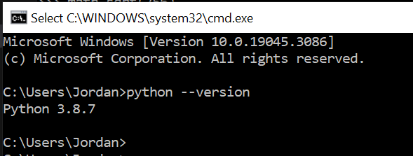
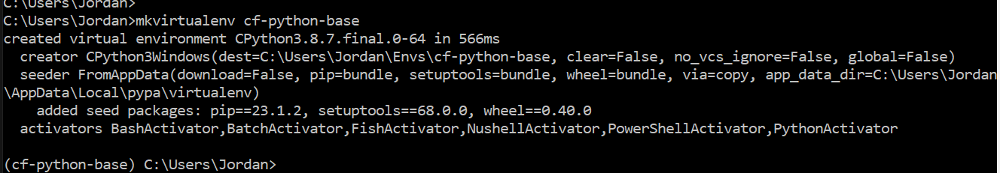
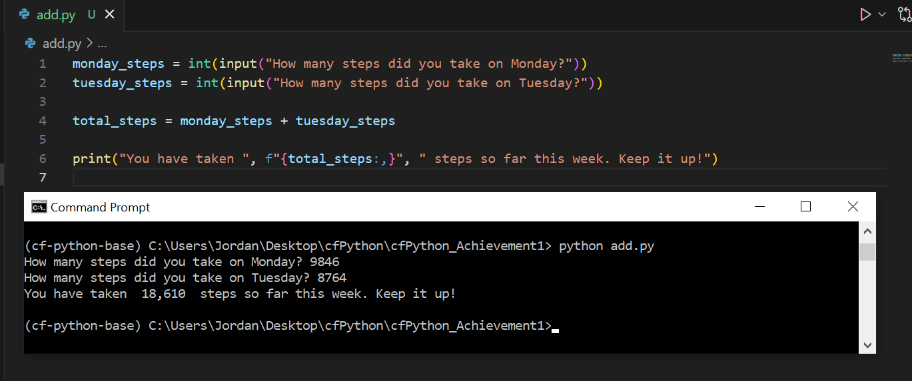
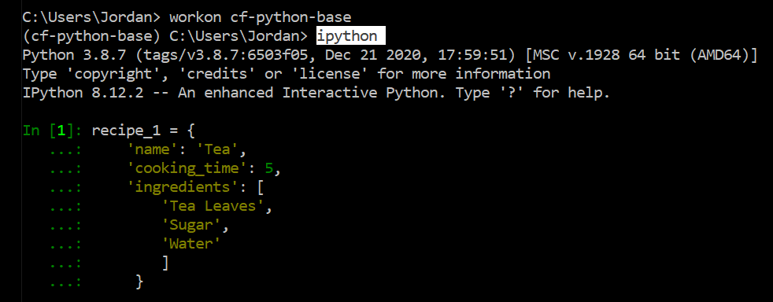
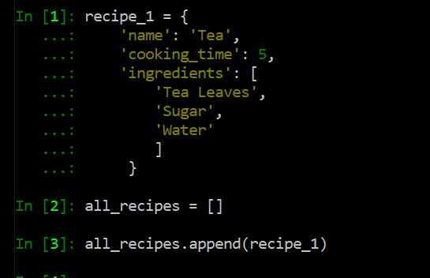
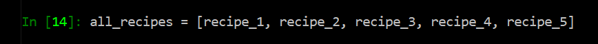
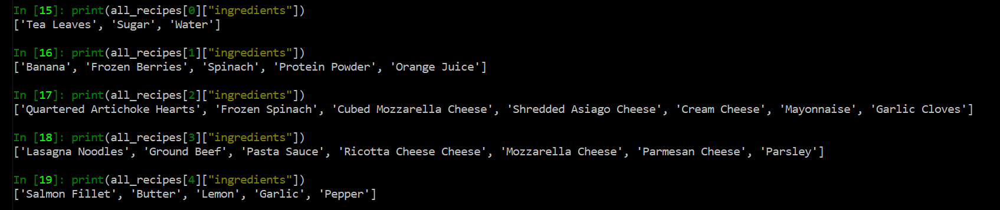

# cfPython_Achievement1
 _Note to viewer: The majority of this project is using Windows and Command Prompt_

## Table of Contents

1. [Exercise 1.1](#task1)
2. [Exercise 1.2](#task2)


## Exercise 1.1 <a name="task1"></a>
### Getting Started with Python

#### Install Python
Check if you already have Python installed by entering `python --version` in your terminal. If you do not already have Python installed, follow the instructions provided at https://www.python.org/downloads/. _this project was made using **Python 3.8.7**_

   

Create your virtual environment using `mkvirtualenv <your_env_name`

   

Create an add.py Python file in Visual Studio Code (or your preferred text editor).
Your _add_ function should define two variables that a user can input when prompted. The function will add the values together and output a statement.

```python
monday_steps = int(input("How many steps did you take on Monday?"))
tuesday_steps = int(input("How many steps did you take on Tuesday?"))

total_steps = monday_steps + tuesday_steps

print("You have taken ", f"{total_steps:,}", " steps so far this week. Keep it up!")
```
Now test your function in your terminal. 
In your Windows Command Prompt, and in your environment, cd to the folder your Python script is in.

```
C:\Users\username> workon <your_environment_name>
(<your_environment_name>) C:\Users\username> cd .\path\to\script
(<your_environment_name>) C:\Users\username\path\to\script> python add.py
```


In order to allow your script to run across environments, you can add a requirements.txt file.
This file automatically installs required packages in any other environment you want to run your script in.

```
# use 'pip freeze' to record your environment's current package list, and add to a requirements.txt file
(<your_environment_name>) C:\Users\username> pip freeze > requirements.txt

# deactivate your original environment and create a new one
(<your_environment_name>) C:\Users\username> deactivate
C:\Users\username> mkvirtualenv <your_environment_name>_copy

#install requirements.txt to new environment
(<your_environment_name>_copy) C:\Users\username> pip install -r requirements.txt
```


## Exercise 1.2 <a name="task2"></a>
### Data Types

First, open an iPython shell in your working environment.

#### Create a Dictionary
In your iPython shell, create a *dictionary* structure for your first recipe, called `recipe_1`.
Here, our structure is made up of keys and values to make a `Tea` (str), that will take `5` minutes to make (int), and will contains a `list` of three ingredients.



A *dictionary* structure is going to be used for making this recipe app, as the app will require the flexibility to easily modify recipes. Dictionaries are also composed of key/value pairs, which sets up our app for what it needs: the `keys` are the “name”, “cooking_time”, and “ingredients”.  All of these keys need to be paired with `values` which is the specific information of recipe that the user will refer to.

#### Create a List
Create an outer structure called `all_recipes`
Use `append()` to add your dictionary, recipe_1, to the list.



A _list_ is used in this case as it creates a sequential and dynamic structure of our recipes, and will allow us to easily access each individual element through indexing.


#### Add More Recipes
Follow the same steps to add four more recipes...


Add the rest of the dictionaries to your all_recipes list



#### Print Contents
Once you have all your recipes added to the list, print out each recipe's ingredients as five different lists.



