# cfPython_Achievement1
<!--
 _Note to viewer: The majority of this project is using Windows and Command Prompt_


## Table of Contents

1. [Exercise 1.1](#task1)
2. [Exercise 1.2](#task2)

-->

<details>
<summary><h2>Exercise 1.1: Getting Started with Python <a name="task1"></a></h2></summary>
 
#### Install Python
Check if you already have Python installed by entering `python --version` in your terminal. If you do not already have Python installed, follow the instructions provided at https://www.python.org/downloads/. _this project was made using **Python 3.8.7**_

   

Create your virtual environment using `mkvirtualenv <your_env_name`

   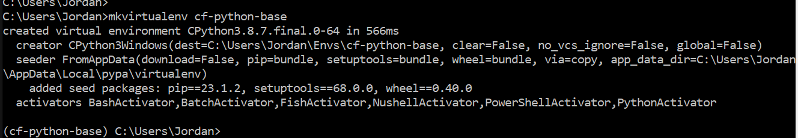

Create an add.py Python file in Visual Studio Code (or your preferred text editor).
Your _add_ function should define two variables that a user can input when prompted. The function will add the values together and output a statement.

```python
monday_steps = int(input("How many steps did you take on Monday?"))
tuesday_steps = int(input("How many steps did you take on Tuesday?"))

total_steps = monday_steps + tuesday_steps

print("You have taken ", f"{total_steps:,}", " steps so far this week. Keep it up!")
```
Now test your function in your terminal. 
In your Windows Command Prompt, and in your environment, cd to the folder your Python script is in.

```
C:\Users\username> workon <your_environment_name>
(<your_environment_name>) C:\Users\username> cd .\path\to\script
(<your_environment_name>) C:\Users\username\path\to\script> python add.py
```
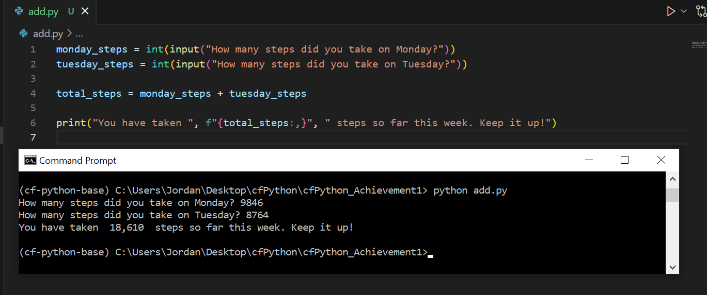

In order to allow your script to run across environments, you can add a requirements.txt file.
This file automatically installs required packages in any other environment you want to run your script in.

```
# use 'pip freeze' to record your environment's current package list, and add to a requirements.txt file
(<your_environment_name>) C:\Users\username> pip freeze > requirements.txt

# deactivate your original environment and create a new one
(<your_environment_name>) C:\Users\username> deactivate
C:\Users\username> mkvirtualenv <your_environment_name>_copy

#install requirements.txt to new environment
(<your_environment_name>_copy) C:\Users\username> pip install -r requirements.txt
```
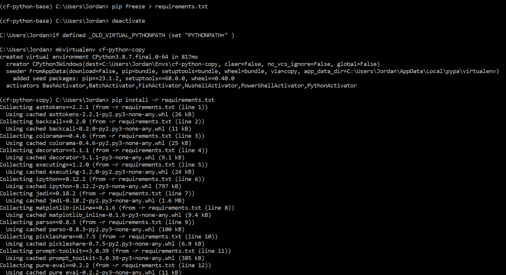

</details>

<!--------------------------------------------------------------------------------------------------------------------------------------------->
<!--------------------------------------------------------------------------------------------------------------------------------------------->

<details>
<summary><h2>Exercise 1.2: Data Types<a name="task2"></a></h2></summary>

First, open an iPython shell in your working environment.

#### Create a Dictionary
In your iPython shell, create a *dictionary* structure for your first recipe, called `recipe_1`.
Here, our structure is made up of keys and values to make a `Tea` (str), that will take `5` minutes to make (int), and will contains a `list` of three ingredients.

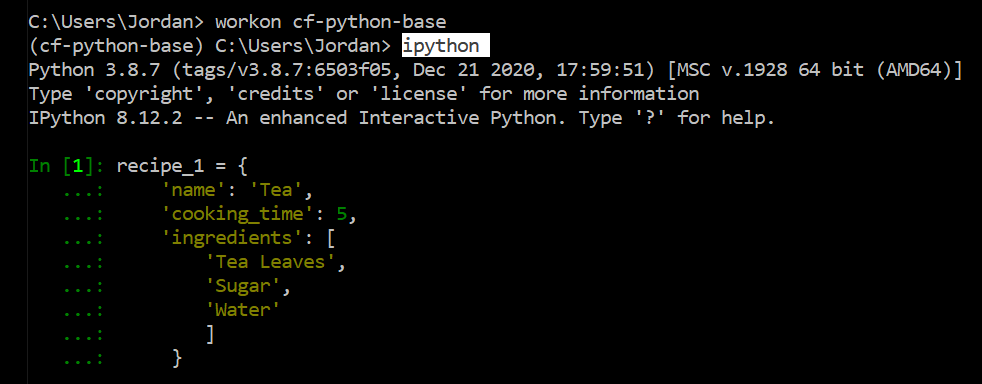

A *dictionary* structure is going to be used for making this recipe app, as the app will require the flexibility to easily modify recipes. Dictionaries are also composed of key/value pairs, which sets up our app for what it needs: the `keys` are the “name”, “cooking_time”, and “ingredients”.  All of these keys need to be paired with `values` which is the specific information of recipe that the user will refer to.

#### Create a List
Create an outer structure called `all_recipes`
Use `append()` to add your dictionary, recipe_1, to the list.

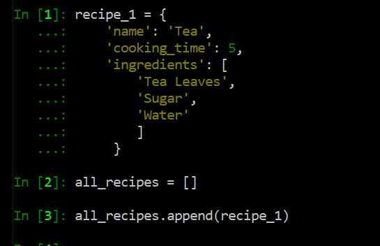

A _list_ is used in this case as it creates a sequential and dynamic structure of our recipes, and will allow us to easily access each individual element through indexing.


#### Add More Recipes
Follow the same steps to add four more recipes...

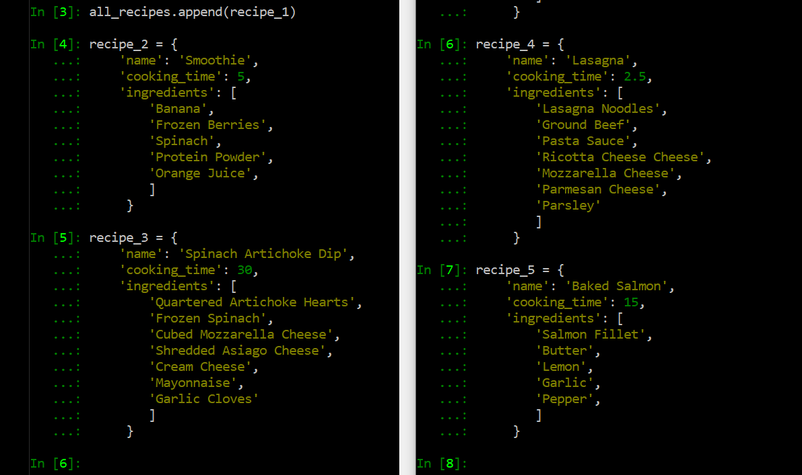

Add the rest of the dictionaries to your all_recipes list

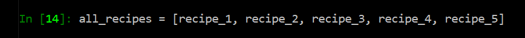

#### Print Contents
Once you have all your recipes added to the list, print out each recipe's ingredients as five different lists.

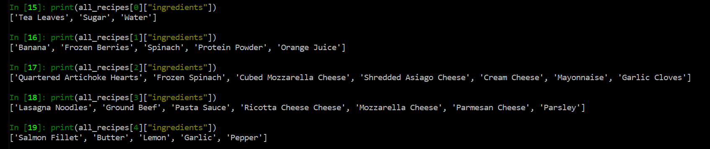

</details>

<!--------------------------------------------------------------------------------------------------------------------------------------------->
<!--------------------------------------------------------------------------------------------------------------------------------------------->


<details>
<summary><h2>Exercise 1.3: Operators & Functions</h2></summary>

### Using operators and functions to display user inputs

_Step 1_<br>
Open a code editor. This example uses Visual Studio Code.

_Step 2_<br>
Create two empty lists: one called `recipes_list`, and one called `ingredients_list`

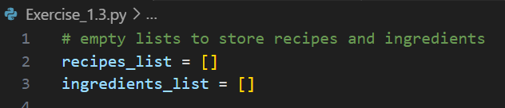


_Step 3_<br>
Define a function called `take_recipe`
This function should call for several user inputs: a recipe’s name (string), the amount of time to cook the recipe (integer), and a list of ingredients that the recipe will call for.
Next, create a dictionary called `recipe` that will store these variables as key/value pairs.

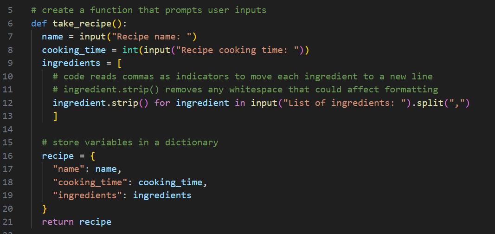


_Step 4_<br>
Prompt the user to input how many recipes they want to add. This integer will be stored to `n`.

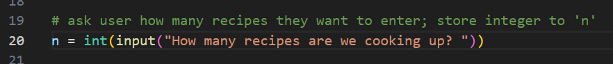


_Step 5_<br>
Create a *for loop* that will iterate through the number of recipes indicated by the user in step 4. This for loop will check if an ingredient entered by the user is already in the ingredients_list. If it is not, the new ingredient will be appended to the ingredients_list. Each new recipe is appended to the recipes_list.


_Step 6, Part 1_<br>
Create a *for loop* that will check boolean logic of each recipe according to if/and statements. Four different scenarios are checked to determine the recipe’s level of difficulty.
`if` the recipe’s cooking time is _less than 10_ minutes `and` the length of ingredients in the list is _less than 4_, set difficulty to *Easy*
`if` the recipe’s cooking time is _less than 10_ minutes `and` the length of ingredients in the list is _greater than or equal to 4_, set difficulty to *Medium*
`if` the recipe’s cooking time is _greater than or equal to 10_ minutes `and` the length of ingredients in the list is _less than 4_, set difficulty to *Intermediate*
`if` the recipe’s cooking time is _greater than or equal to 10_ minutes `and` the length of ingredients in the list is _greater than 4_, set difficulty to *Hard*

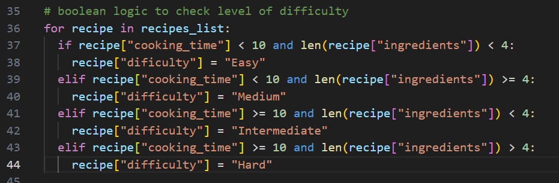

_Step 6, Part 2_<br>
Create a for loop that will iterate through each recipe in the recipes_list, and print the recipe’s name, the cooking time, the ingredients needed (as another for loop to loop through the list of ingredients), and the level of difficulty.


_Step 7_<br>
Create a function called `display_ingredients` that will show all the ingredients available across all recipes. The list needs to be alphabetized, which can be done using Python’s built-in `sort()`.
The function then will loop through the alphabetized list of ingredients and print each one, once the function is called using `display_ingredients()`.

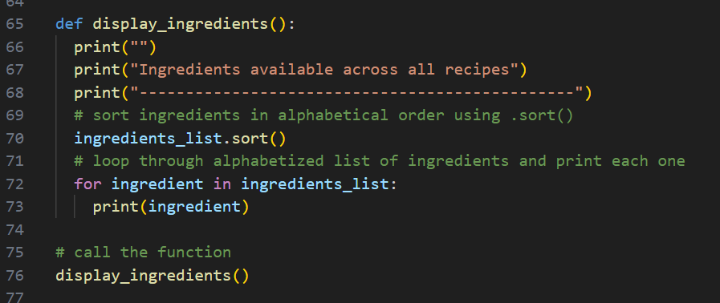


<h3>Check your work</h3>
In Visual Studio Code, press the “play button” in the top right-hand corner of your screen. This will open up your terminal and begin prompting for user input. This will be a great place to double check for any errors in your code.

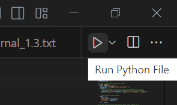

Once you’ve input everything it asks for, your results will show immediately.
Play with formatting to make your output easier to read.

_example:_

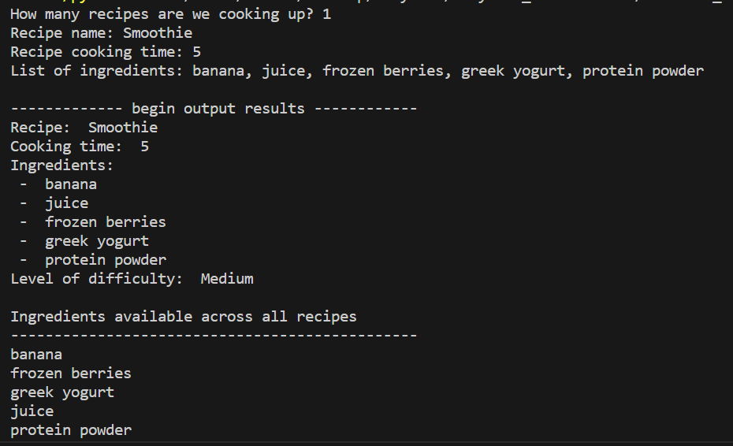

</details>

<!--------------------------------------------------------------------------------------------------------------------------------------------->
<!--------------------------------------------------------------------------------------------------------------------------------------------->

<details>
<summary><h2>Exercise 1.4: File Handling</h2></summary>
<details>
<summary><h4>Part 1: Create <code>recipe_input.py</code></h4></summary>

This script will load and store data into a binary file based on user input.<br>
Later, the stored data will be accessed by another script: `recipe_search.py`

 _Step 1_<br>
`import pickle` in order to work with binary files

<!--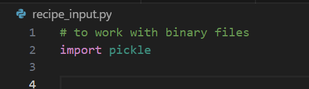-->


_Step 2_<br>
Define a function called `take_recipe()`<br>
This is where user inputs will put together the recipes.
Recipes should include:
1. a recipe name
2. cooking time
3. necessary ingredients
4. a level of difficulty (to be defined in another function)

<!--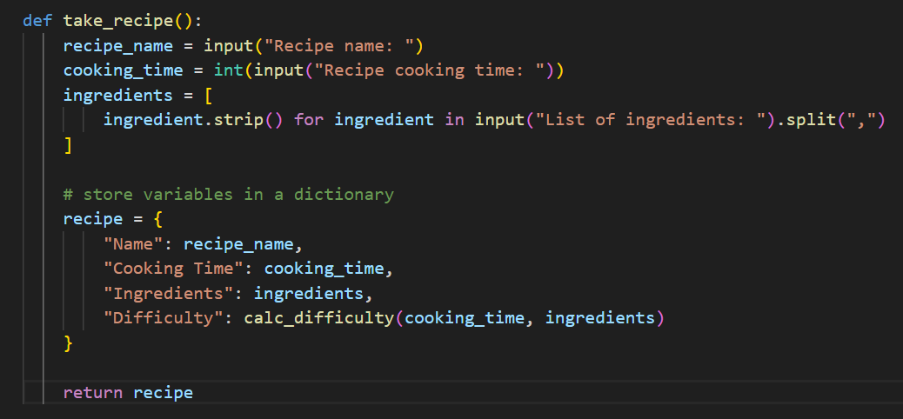-->


_Step 3_<br>
Level of difficulty is first calculated with another function, called `calc_difficulty`<br>
Difficulty is identified by the `cooking_time` and number of `ingredients`
The levels are returned as `Easy`, `Medium`, `Intermediate`, or `Hard`

<!--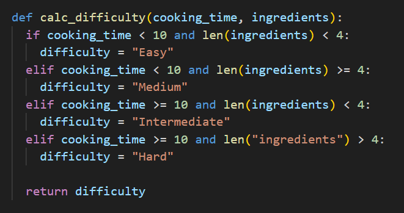-->


All of these values should be added to a dictionary for later use.


_Step 4_<br>
Now we begin with the main code.
Define a `try-except-else-finally` block
1. `Try` a block of code where an error might occur. In this case, we will `try` opening a binary file named by the user, and load contents to it using the `pickle` module. 

<!--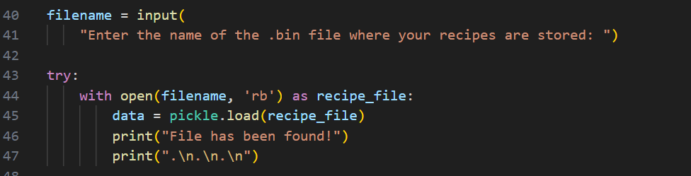-->


2. If there is no file by the name the user input, the `except` block will display a `FileNotFoundError` message to the user. The script will create a file named with what the user input.
3. Other errors are handled with another `except` block
4. `Finally` the script extracts the values from the dictionary into two lists: `recipes_list` and `all_ingredients`

<!--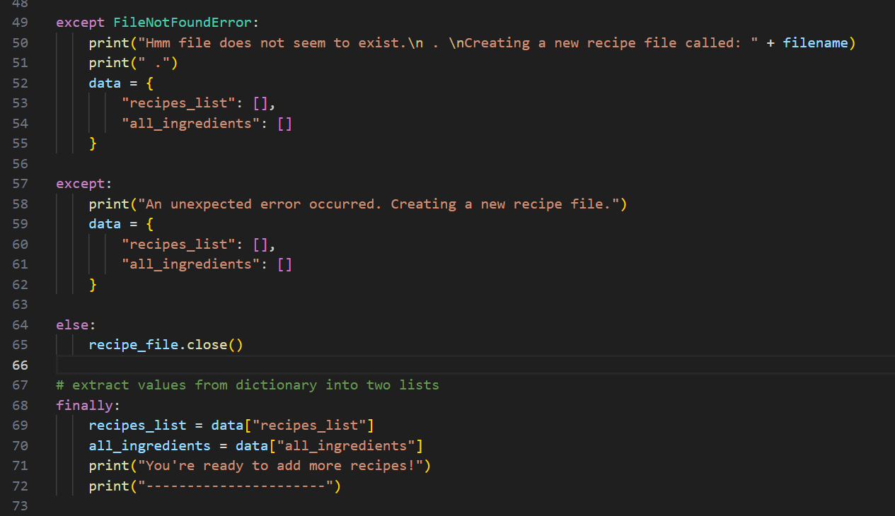-->


_Step 5_<br>
A for loop will loop through the number of recipes that the user enters and call the `take_recipe()` function.
It will add each new recipe to the `recipes_list` dictionary. It will also loop through existing ingredients in the `all_ingredients` dictionary and will add any new ingredients that do not already exist.

<!---->


_Step 6_<br>
The updated `recipes_list` and `all_ingredients` are added to a dictionary named `data`

<!--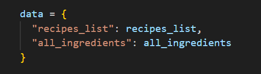-->


_Step 7_<br>
Use the pickle module to write the updated data to the user-defined file

<!--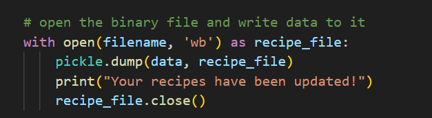-->


</details>
<details>
<summary><h4>Part 2: Create <code>recipe_search.py</code></h4></summary>

This script will read the saved data in the binary file that `recipe_input.py` wrote to.
With more user inputs, `all_ingredients` is displayed to the user after they enter the binary file's name.
Then the user can select a specific ingredient and the script will display any recipe that has that particular ingredient stored.

_Step 1_<br>
Import the `pickle` module

<!--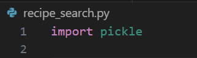-->


_Step 2_<br>
Define a function called `display_recipe()`
This function will take each recipe as an argument and print all of its attributes: _Recipe Name_, _Cooking Time_, _Ingredients_, and _Difficulty_.

<!--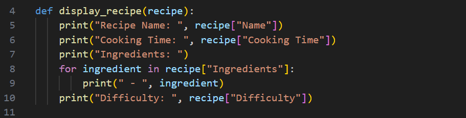-->


_Step 3_<br>
Define another function called `search_ingredient()`
This function should take a dictionary called `data` as an argument. It will:
1. print all available ingredients under a key `all_ingredients`<br>
Each ingredient is shown with a number; use `enumerate()` to take the index of each ingredient
2. define a `try` block<br>
the user will `try` to pick a number from the list, and if it exists, it is stored in `ingredient_searched`
3. the `except` clause warns the user if the input is incorrect
4. an `else` clause is added to display any recipe in `recipes_list` that contains the searched ingredient

<!--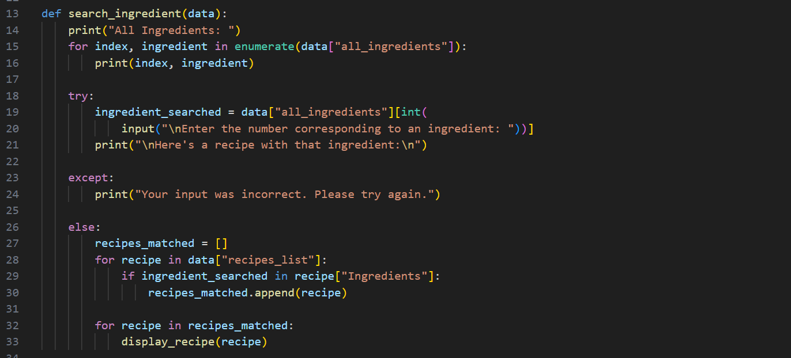-->


_Step 4_<br>
Prompt the user to input the name of the binary file where recipe_input.py wrote recipe data to.

<!--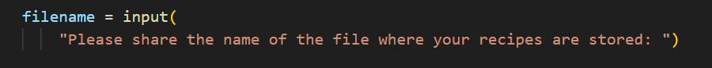-->


_Step 5_<br>
A `try` block attempts to open the file. If it successfully opens the file, it will extract the `data` using the `pickel` module

<!--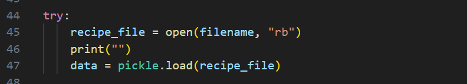-->


_Step 6_<br>
Add an `except` clause for if the file is not found, using `except FileNotFoundError:`

<!--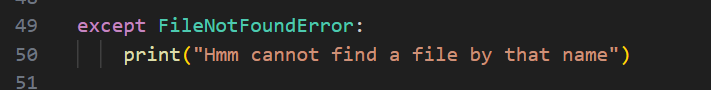-->


_Step 7_<br>
If the `try` block doesn’t encounter any errors, and `else` block will call the `search_ingredient` function and pass data into it as an argument.

<!--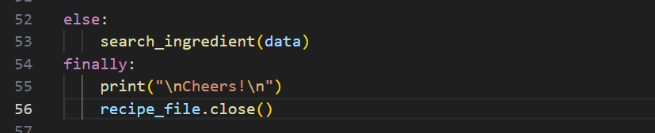-->


</details>
<details>
<summary><h4>Testing</h4></summary>

<h4><code>recipe_input.py</code></h4>

The script prompts the user to enter a filename where they want their recipes stored.
If the file exists, the script uses that file; however, if the file does not exist, a new file is created:

<!--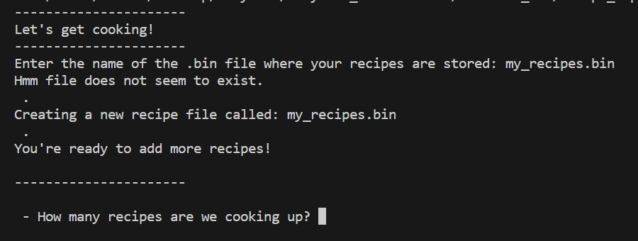-->


The user then enters:
1.	how many recipes they want to add
2.	the name of the recipe
3.	the cooking time for the recipe
4.	and the ingredients needed

<!--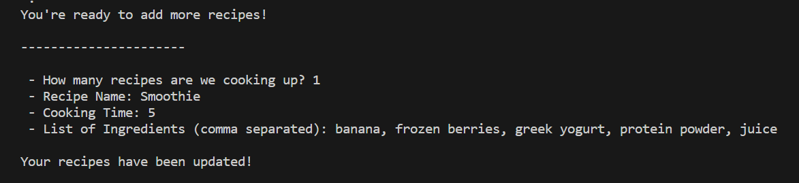-->


Once completed, data is added to a binary file 

<!--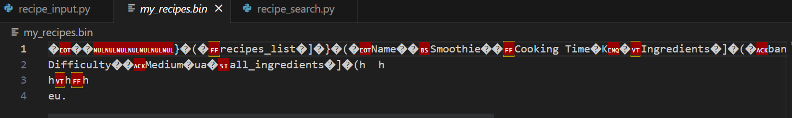 -->


<h4><code>recipe_search.py</code></h4>

This script starts by asking the user which file they added their recipe to.
The script searches this file and lists `all_ingredients`

<!--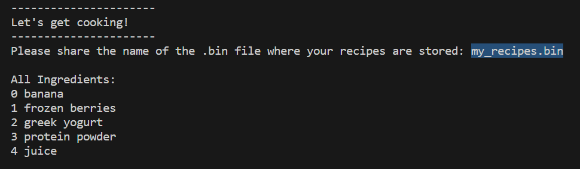-->


Next it prompts the user to enter a number that’s next to an ingredient that’s been listed. Once entered, the script loads the recipe that’s found to include that ingredient, and loads the recipe to be displayed via the `pickle` method.

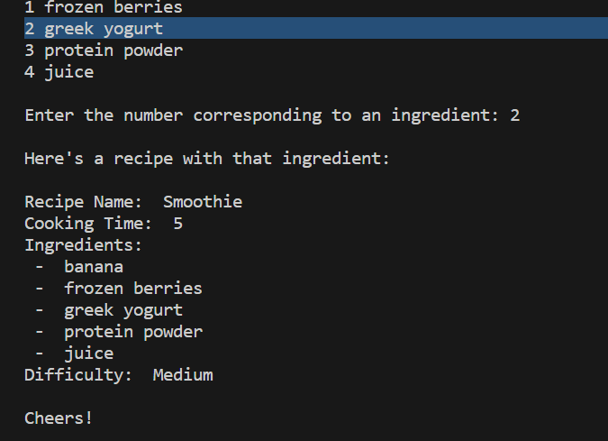

</details>
</details>
</details>


