# cfPython_Achievement1
<!--
 _Note to viewer: The majority of this project is using Windows and Command Prompt_


## Table of Contents

1. [Exercise 1.1](#task1)
2. [Exercise 1.2](#task2)

-->

<details>
<summary><h2>Exercise 1.1: Getting Started with Python <a name="task1"></a></h2></summary>
 
#### Install Python
Check if you already have Python installed by entering `python --version` in your terminal. If you do not already have Python installed, follow the instructions provided at https://www.python.org/downloads/. _this project was made using **Python 3.8.7**_

   

Create your virtual environment using `mkvirtualenv <your_env_name`

   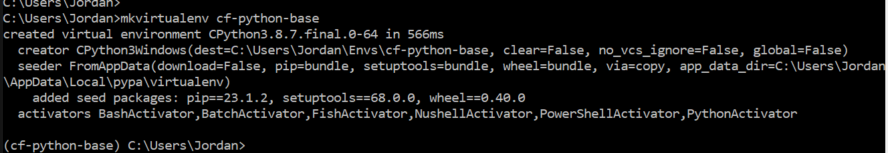

Create an add.py Python file in Visual Studio Code (or your preferred text editor).
Your _add_ function should define two variables that a user can input when prompted. The function will add the values together and output a statement.

```python
monday_steps = int(input("How many steps did you take on Monday?"))
tuesday_steps = int(input("How many steps did you take on Tuesday?"))

total_steps = monday_steps + tuesday_steps

print("You have taken ", f"{total_steps:,}", " steps so far this week. Keep it up!")
```
Now test your function in your terminal. 
In your Windows Command Prompt, and in your environment, cd to the folder your Python script is in.

```
C:\Users\username> workon <your_environment_name>
(<your_environment_name>) C:\Users\username> cd .\path\to\script
(<your_environment_name>) C:\Users\username\path\to\script> python add.py
```
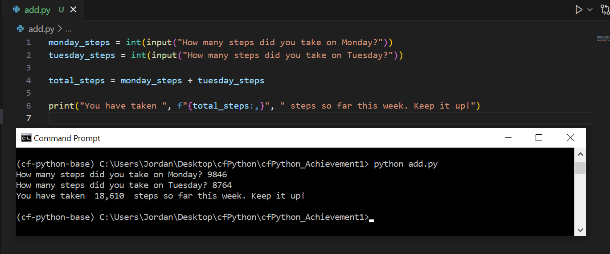

In order to allow your script to run across environments, you can add a requirements.txt file.
This file automatically installs required packages in any other environment you want to run your script in.

```
# use 'pip freeze' to record your environment's current package list, and add to a requirements.txt file
(<your_environment_name>) C:\Users\username> pip freeze > requirements.txt

# deactivate your original environment and create a new one
(<your_environment_name>) C:\Users\username> deactivate
C:\Users\username> mkvirtualenv <your_environment_name>_copy

#install requirements.txt to new environment
(<your_environment_name>_copy) C:\Users\username> pip install -r requirements.txt
```


</details>

<!--------------------------------------------------------------------------------------------------------------------------------------------->
<!--------------------------------------------------------------------------------------------------------------------------------------------->

<details>
<summary><h2>Exercise 1.2: Data Types<a name="task2"></a></h2></summary>

First, open an iPython shell in your working environment.

#### Create a Dictionary
In your iPython shell, create a *dictionary* structure for your first recipe, called `recipe_1`.
Here, our structure is made up of keys and values to make a `Tea` (str), that will take `5` minutes to make (int), and will contains a `list` of three ingredients.

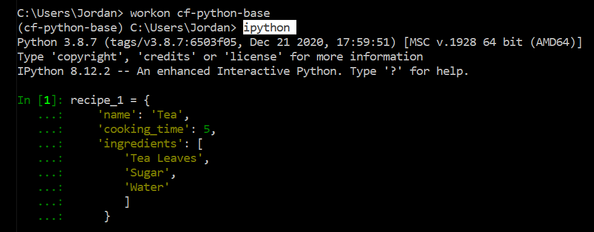

A *dictionary* structure is going to be used for making this recipe app, as the app will require the flexibility to easily modify recipes. Dictionaries are also composed of key/value pairs, which sets up our app for what it needs: the `keys` are the “name”, “cooking_time”, and “ingredients”.  All of these keys need to be paired with `values` which is the specific information of recipe that the user will refer to.

#### Create a List
Create an outer structure called `all_recipes`
Use `append()` to add your dictionary, recipe_1, to the list.


A _list_ is used in this case as it creates a sequential and dynamic structure of our recipes, and will allow us to easily access each individual element through indexing.


#### Add More Recipes
Follow the same steps to add four more recipes...

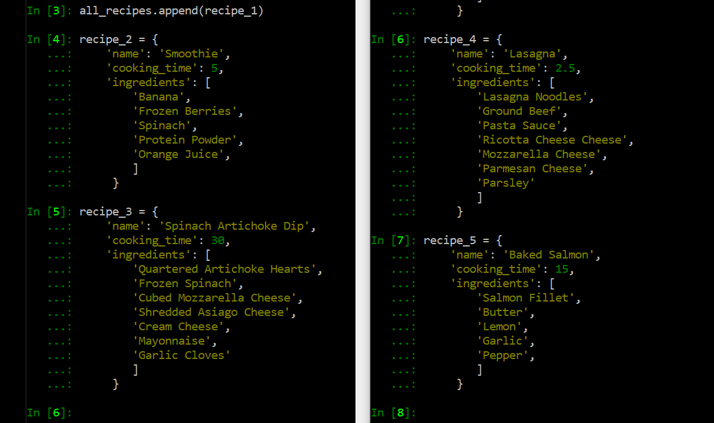

Add the rest of the dictionaries to your all_recipes list


#### Print Contents
Once you have all your recipes added to the list, print out each recipe's ingredients as five different lists.


</details>

<!--------------------------------------------------------------------------------------------------------------------------------------------->
<!--------------------------------------------------------------------------------------------------------------------------------------------->


<details>
<summary><h2>Exercise 1.3: Operators & Functions</h2></summary>

### Using operators and functions to display user inputs

_Step 1_<br>
Open a code editor. This example uses Visual Studio Code.

_Step 2_<br>
Create two empty lists: one called `recipes_list`, and one called `ingredients_list`

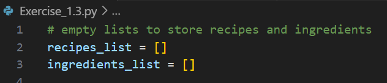


_Step 3_<br>
Define a function called `take_recipe`
This function should call for several user inputs: a recipe’s name (string), the amount of time to cook the recipe (integer), and a list of ingredients that the recipe will call for.
Next, create a dictionary called `recipe` that will store these variables as key/value pairs.

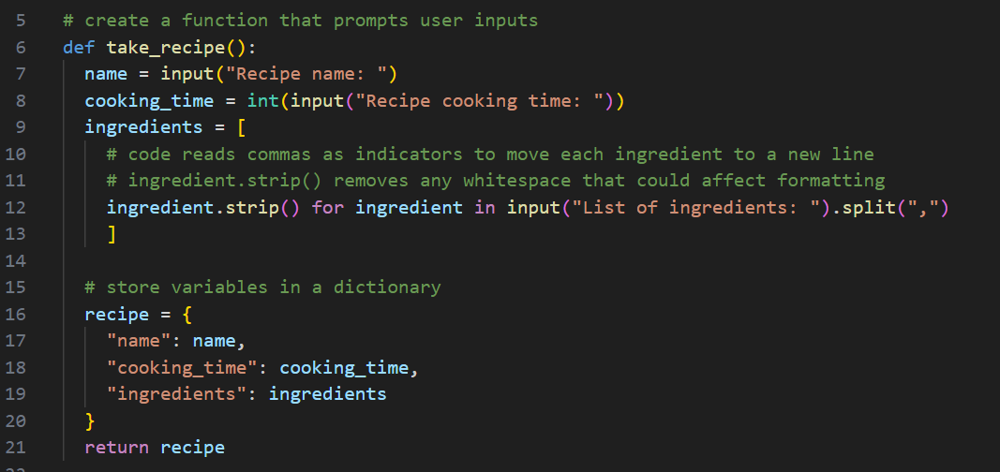


_Step 4_<br>
Prompt the user to input how many recipes they want to add. This integer will be stored to `n`.

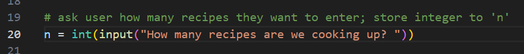


_Step 5_<br>
Create a *for loop* that will iterate through the number of recipes indicated by the user in step 4. This for loop will check if an ingredient entered by the user is already in the ingredients_list. If it is not, the new ingredient will be appended to the ingredients_list. Each new recipe is appended to the recipes_list.

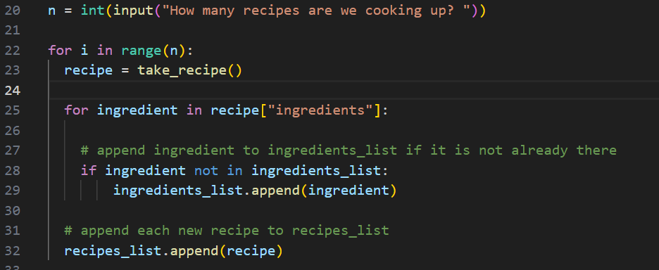


_Step 6, Part 1_<br>
Create a *for loop* that will check boolean logic of each recipe according to if/and statements. Four different scenarios are checked to determine the recipe’s level of difficulty.
`if` the recipe’s cooking time is _less than 10_ minutes `and` the length of ingredients in the list is _less than 4_, set difficulty to *Easy*
`if` the recipe’s cooking time is _less than 10_ minutes `and` the length of ingredients in the list is _greater than or equal to 4_, set difficulty to *Medium*
`if` the recipe’s cooking time is _greater than or equal to 10_ minutes `and` the length of ingredients in the list is _less than 4_, set difficulty to *Intermediate*
`if` the recipe’s cooking time is _greater than or equal to 10_ minutes `and` the length of ingredients in the list is _greater than 4_, set difficulty to *Hard*

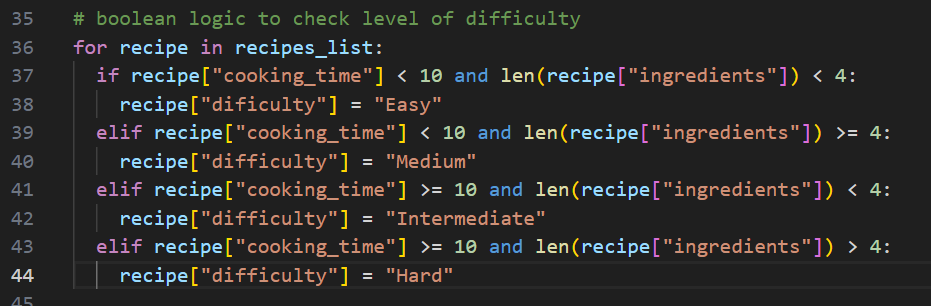

_Step 6, Part 2_<br>
Create a for loop that will iterate through each recipe in the recipes_list, and print the recipe’s name, the cooking time, the ingredients needed (as another for loop to loop through the list of ingredients), and the level of difficulty.

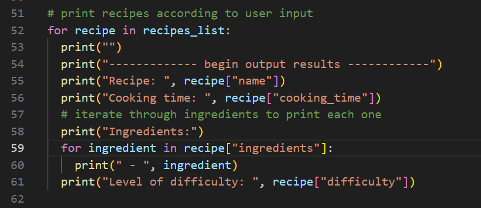


_Step 7_<br>
Create a function called `display_ingredients` that will show all the ingredients available across all recipes. The list needs to be alphabetized, which can be done using Python’s built-in `sort()`.
The function then will loop through the alphabetized list of ingredients and print each one, once the function is called using `display_ingredients()`.

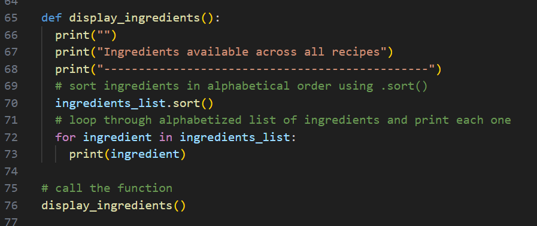


<h3>Check your work</h3>
In Visual Studio Code, press the “play button” in the top right-hand corner of your screen. This will open up your terminal and begin prompting for user input. This will be a great place to double check for any errors in your code.

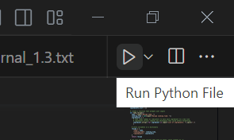

Once you’ve input everything it asks for, your results will show immediately.
Play with formatting to make your output easier to read.

_example:_

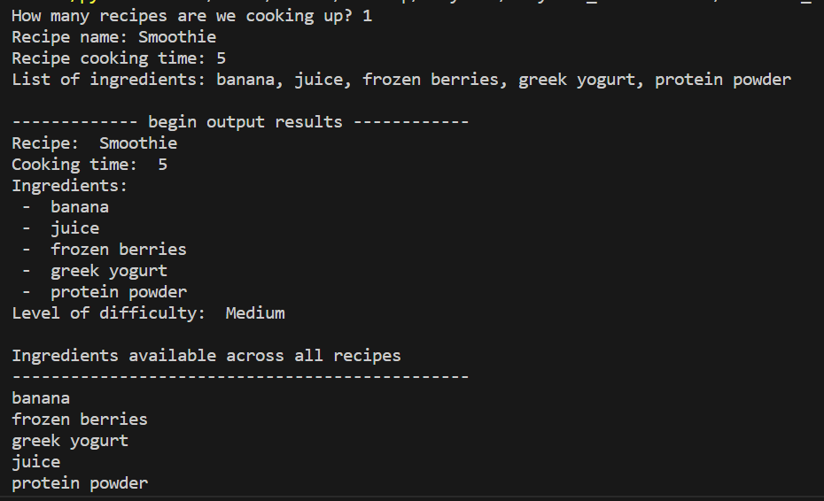

</details>

<!--------------------------------------------------------------------------------------------------------------------------------------------->
<!--------------------------------------------------------------------------------------------------------------------------------------------->

<details>
<summary><h2>Exercise 1.4: File Handling</h2></summary>
<details>
<summary><h4>Part 1: Create <code>recipe_input.py</code></h4></summary>

This script will load and store data into a binary file based on user input.<br>
Later, the stored data will be accessed by another script: `recipe_search.py`

 _Step 1_<br>
`import pickle` in order to work with binary files

<!--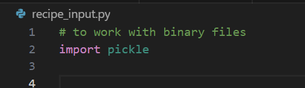-->


_Step 2_<br>
Define a function called `take_recipe()`<br>
This is where user inputs will put together the recipes.
Recipes should include:
1. a recipe name
2. cooking time
3. necessary ingredients
4. a level of difficulty (to be defined in another function)

<!--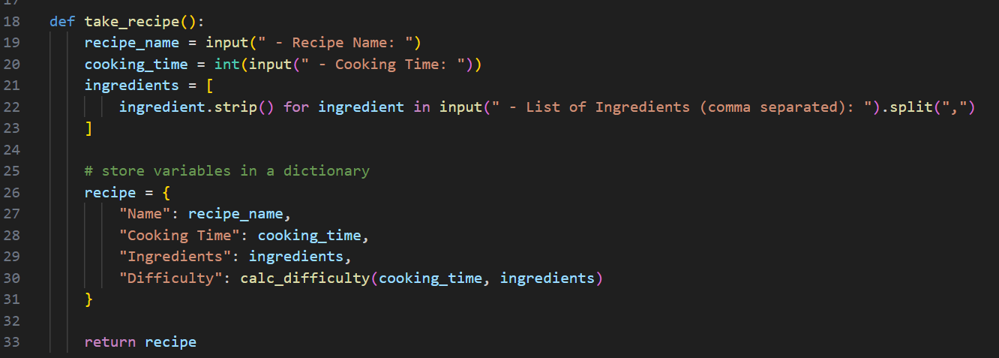-->


_Step 3_<br>
Level of difficulty is first calculated with another function, called `calc_difficulty`<br>
Difficulty is identified by the `cooking_time` and number of `ingredients`
The levels are returned as `Easy`, `Medium`, `Intermediate`, or `Hard`

<!--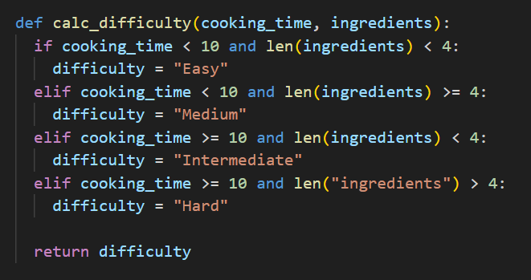-->


All of these values should be added to a dictionary for later use.


_Step 4_<br>
Now we begin with the main code.
Define a `try-except-else-finally` block
1. `Try` a block of code where an error might occur. In this case, we will `try` opening a binary file named by the user, and load contents to it using the `pickle` module. 

<!--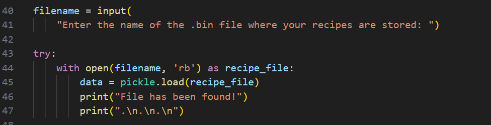-->


2. If there is no file by the name the user input, the `except` block will display a `FileNotFoundError` message to the user. The script will create a file named with what the user input.
3. Other errors are handled with another `except` block
4. `Finally` the script extracts the values from the dictionary into two lists: `recipes_list` and `all_ingredients`

<!--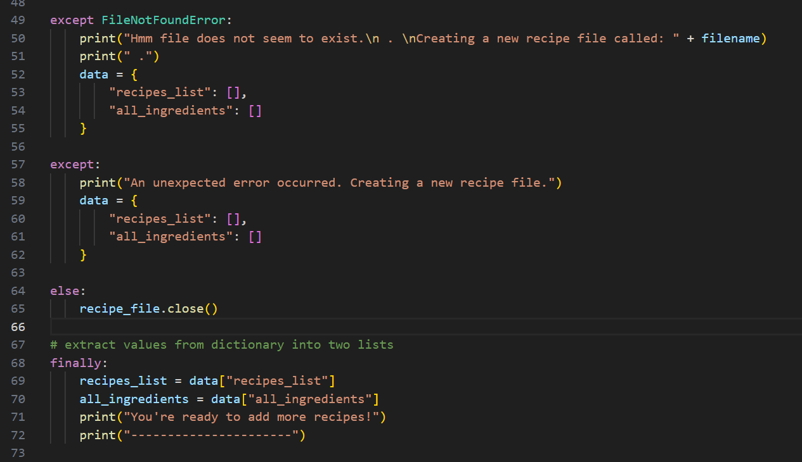-->


_Step 5_<br>
A for loop will loop through the number of recipes that the user enters and call the `take_recipe()` function.
It will add each new recipe to the `recipes_list` dictionary. It will also loop through existing ingredients in the `all_ingredients` dictionary and will add any new ingredients that do not already exist.

<!--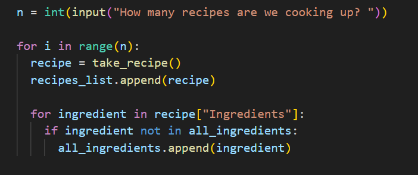-->


_Step 6_<br>
The updated `recipes_list` and `all_ingredients` are added to a dictionary named `data`

<!--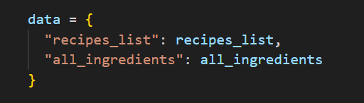-->


_Step 7_<br>
Use the pickle module to write the updated data to the user-defined file

<!--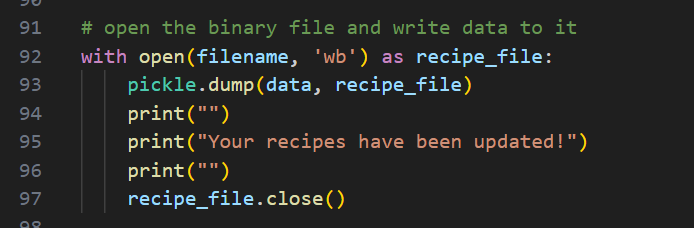-->


</details>
<details>
<summary><h4>Part 2: Create <code>recipe_search.py</code></h4></summary>

This script will read the saved data in the binary file that `recipe_input.py` wrote to.
With more user inputs, `all_ingredients` is displayed to the user after they enter the binary file's name.
Then the user can select a specific ingredient and the script will display any recipe that has that particular ingredient stored.

_Step 1_<br>
Import the `pickle` module

<!--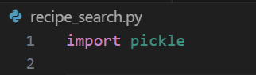-->


_Step 2_<br>
Define a function called `display_recipe()`
This function will take each recipe as an argument and print all of its attributes: _Recipe Name_, _Cooking Time_, _Ingredients_, and _Difficulty_.

<!--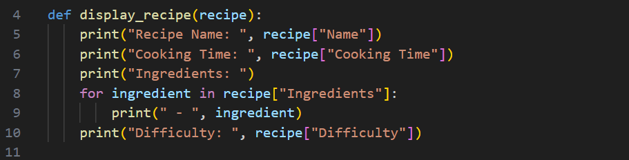-->


_Step 3_<br>
Define another function called `search_ingredient()`
This function should take a dictionary called `data` as an argument. It will:
1. print all available ingredients under a key `all_ingredients`<br>
Each ingredient is shown with a number; use `enumerate()` to take the index of each ingredient
2. define a `try` block<br>
the user will `try` to pick a number from the list, and if it exists, it is stored in `ingredient_searched`
3. the `except` clause warns the user if the input is incorrect
4. an `else` clause is added to display any recipe in `recipes_list` that contains the searched ingredient

<!--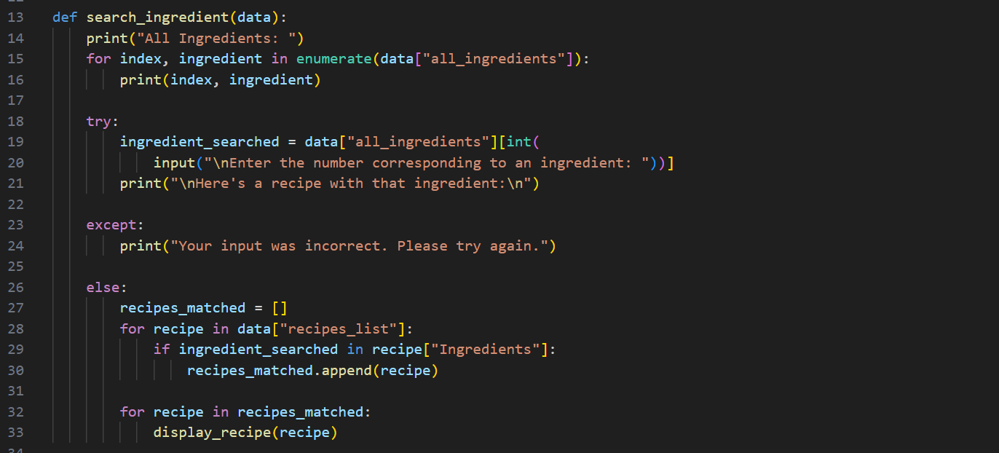-->


_Step 4_<br>
Prompt the user to input the name of the binary file where recipe_input.py wrote recipe data to.

<!--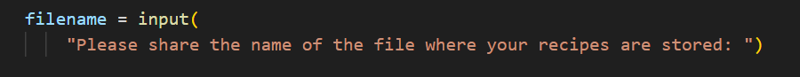-->


_Step 5_<br>
A `try` block attempts to open the file. If it successfully opens the file, it will extract the `data` using the `pickel` module

<!--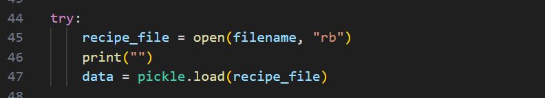-->


_Step 6_<br>
Add an `except` clause for if the file is not found, using `except FileNotFoundError:`

<!--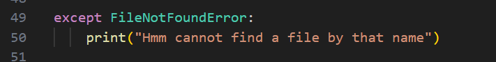-->


_Step 7_<br>
If the `try` block doesn’t encounter any errors, and `else` block will call the `search_ingredient` function and pass data into it as an argument.

<!--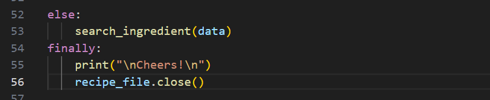-->


</details>
<details>
<summary><h4>Testing</h4></summary>

<h4><code>recipe_input.py</code></h4>

The script prompts the user to enter a filename where they want their recipes stored.
If the file exists, the script uses that file; however, if the file does not exist, a new file is created:

<!--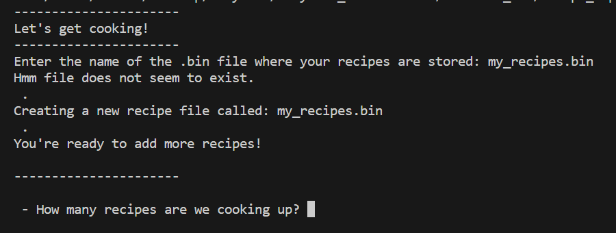-->


The user then enters:
1.	how many recipes they want to add
2.	the name of the recipe
3.	the cooking time for the recipe
4.	and the ingredients needed

<!--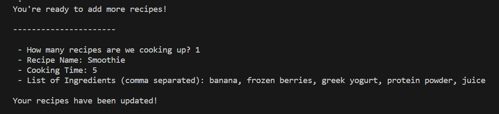-->


Once completed, data is added to a binary file 

<!--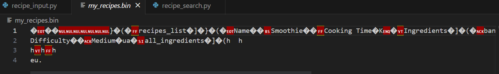 -->


<h4><code>recipe_search.py</code></h4>

This script starts by asking the user which file they added their recipe to.
The script searches this file and lists `all_ingredients`

<!--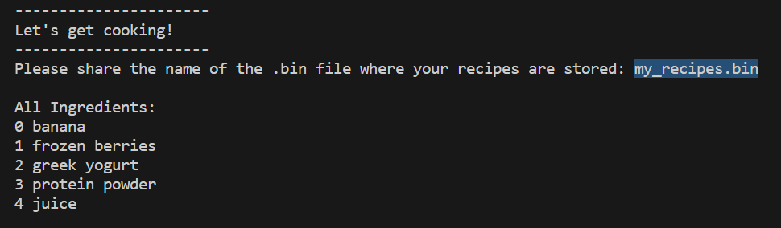-->


Next it prompts the user to enter a number that’s next to an ingredient that’s been listed. Once entered, the script loads the recipe that’s found to include that ingredient, and loads the recipe to be displayed via the `pickle` method.


</details>
</details>
</details>


<!--------------------------------------------------------------------------------------------------------------------------------------------->
<!--------------------------------------------------------------------------------------------------------------------------------------------->

<details>
<summary><h2>Exercise 1.5: Object-Oriented Programming</h2></summary>

*Object-Oriented Programming* is the concept of coding with `classes` which act as a container for `objects`. This method of programming is geared toward keeping code organized, readable, and reusable.
This project demonstrates storing data – in this case a _recipe_ — into `objects`, which have their own attributes and custom methods. All of this will be in one `Recipe` class.
The _methods_ will allow a user to search for a recipe based on a selected ingredient.


<br>_Step 1_<br>
In a new .py file, define a class called `Recipe`.
`Recipe` will contain the following _data attributes_:
*	`name` of recipe
*	`ingredients` as a _list_
*	`cooking_time` as an integer defining amount of time to make the recipe
*	`difficulty`, which is defined and auto-generated by a separate class method

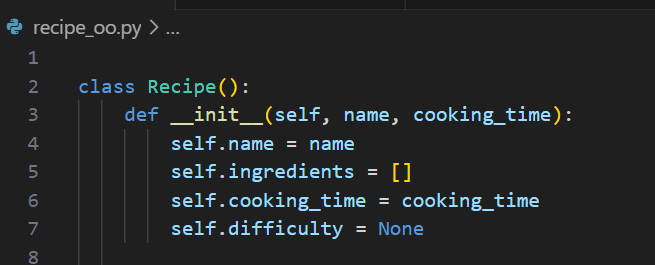


<br>_Step 2_<br>
Define procedural attributes, or `methods` for the `Recipe` class.
*	Initialize `name` of recipe, as well as *getter* and *setter* methods for `name` and `cooking_time`. _This will allow the application to read and modify the values of “name” and “cooking_time” based on user inputs. _

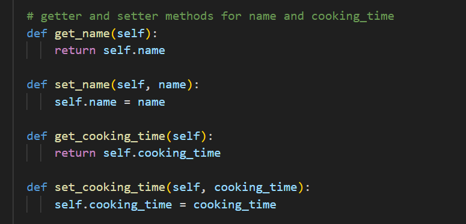
 
*	Create a method called `add_ingredients` that can take in any number of variables and append them to an `ingredients` list.
Hint: this function will call `update_all_ingredients()`, defined later

*	Add a *getter* method for `ingredients – this will return the ingredients list 

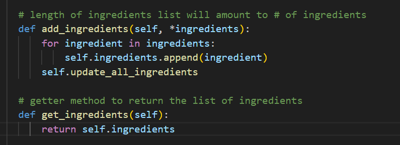

*	Create a `calculate_difficulty()` method (called in step 1) that identifies levels of recipe complexity based on cooking_time and number of ingredients

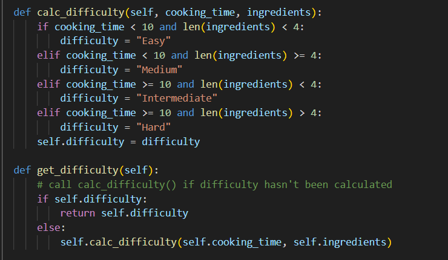
 
*	A *search method* will take an ingredient as an argument, search for it in the `recipe` object, and return a boolean response if the ingredient is found or not

* `update_all_ingredients()` will go through the object’s ingredients. If new ingredients are found they are appended to the class variable, `all_ingredients`.<br>
As a *class variable*, this will be able to add new ingredients across all recipes, or `objects`.
*	Now, the entire recipe can be returned. Formatting should be applied for readability.

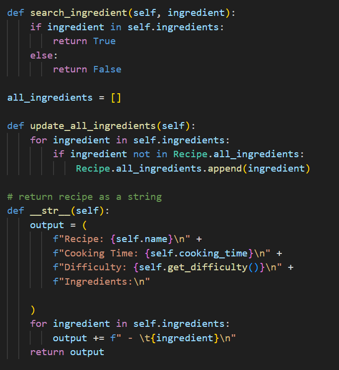


<br>_Step 3_<br>
Add functionality to find an object containing a specific variable. In this project, _find a recipe that contains a specific ingredient_. 
*	 Define two parameters: `data` and `search_term` <br>
The *data* consists of the recipe objects available, and the *search_term* is what is searched for amongst the given object list.
*	This will operate via a `for loop`

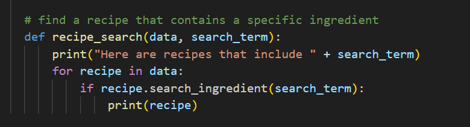
 

<br>_Step 4_<br>
Create an object
*	Initialize an object with a recipe name
*	Add ingredients to the object
*	Set a cooking time
*	Display the object as a string

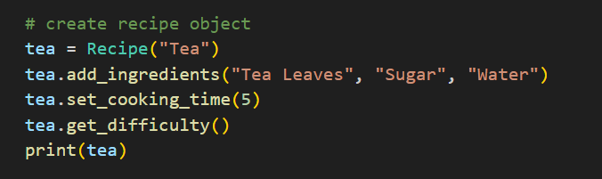

<br>_Step 5_<br>
Add more recipes, similar to _Step 4_

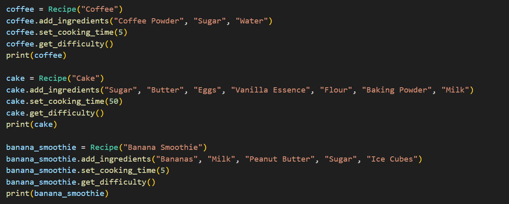

<br>_Step 6_<br>
Collect all recipes into a list (`recipes_list`)

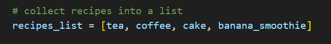
 
<br>_Step 7_<br>
Try the `recipe_search()` method to search for recipes that contain specified ingredients

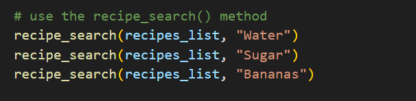


<h2>Testing</h2>

Run the Python script in the terrminal.
The output should list all of the availble recipe objects in their entirety, and then show all recipe objects that contain the ingredient that is searched for.

</details>


<!--------------------------------------------------------------------------------------------------------------------------------------------->
<!--------------------------------------------------------------------------------------------------------------------------------------------->

<details>
<summary><h2>Exercise 1.6: Databases</h2></summary>


<details>
<summary><h4>Part 1: Create and Connect Database</h4></summary>

<br>_Step 1_<br>
*	pip install mysql-connector-python
*	open ipython shell, and type: import mysql.connector

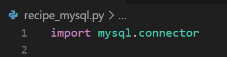


<br>_Step 2_<br>
*	initialize a connection object called `conn`
*	This object acts as a connection between the Python session and the MySQL server

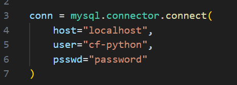

<br>_Step 3_<br>
*	Initialize a `cursor`
*	This will allow you to perform operations on the database with SQL queries

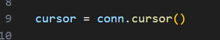


<br>_Step 4_<br>
*	Create a database called `task_database`

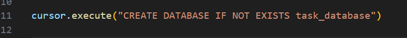


<br>_Step 5_<br>
*	Connect to the newly created database with the `USE <database>` query

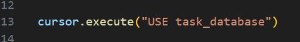


<br>_Step 6_<br>
Create a table called `Recipes`
`id`: integer type.
`name`: string type with a limit of 50 characters. Used to store the name of the recipe.
`ingredients`: string type with a limit of 255 characters. Used to store types of ingredients.
`cooking_time`: integer type. Used to store recipe cooking time in minutes.
`difficulty`: string type with a limit of 20 characters. Used to story level of difficulty (Easy, Medium, Intermediate, Hard).
To view the entire table, open a mysql Command Line Client, select your database, and type DESCRIBE `table`

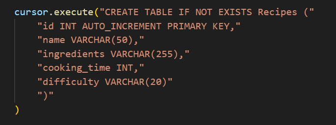


</details>


<details>
<summary><h4>Part 2: Create a Main Menu</h4></summary>

<br>_Step 1_<br>
* Implement a “main menu”. Menu should include 4 options: create recipe; search for recipe; update recipe; and delete recipe

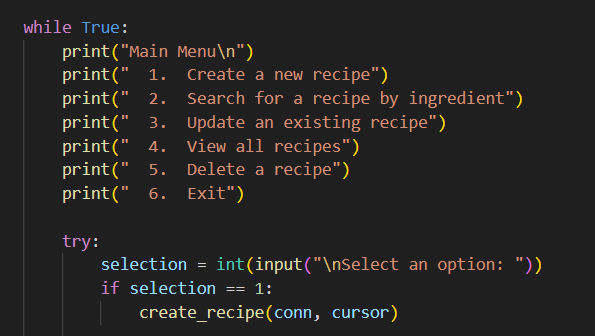

<br>_Step 2_<br>

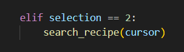

<br>_Step 3_<br>

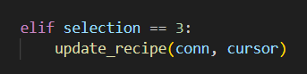

<br>_Step 4_<br>

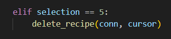


</details>

<details>
<summary><h4>Part 2: Create a Recipe with create_recipe()</h4></summary>

<br>_Step 1_<br>
*	Collect: `name`, `cooking_time`, and `ingredients`
  
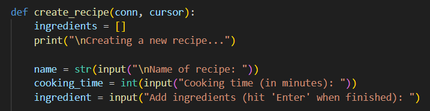


<br>_Step 2_<br>
* Call the `calc_difficulty()` function
  


<br>_Step 3_<br>
* Connect information to a SQL query
  
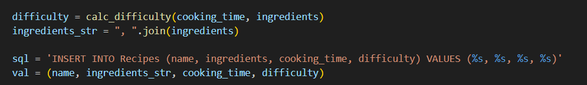


<br>_Step 4_<br>
* Execute query and commit changes
  
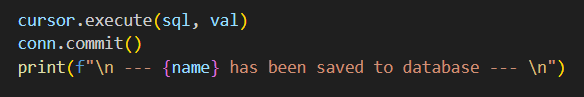

</details>

<h3>Part 4: Search for Recipe with `search_recipe()`</h3>

<br>_Step 1_<br>
* Run SQL queries on the database to access recipes based on ingredients selected by user.
* `SELECT` ingredients column


<br>_Step 2_<br>
* Add each ingredient to a new list called `all_ingredients`
  
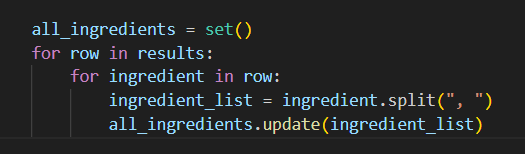


<br>_Step 3_<br>
* Display all ingredients

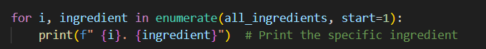


<br>_Step 4_<br>
* `SELECT` ingredients column `WHERE` a specific search pattern (ex: name of ingredient) occurs
  
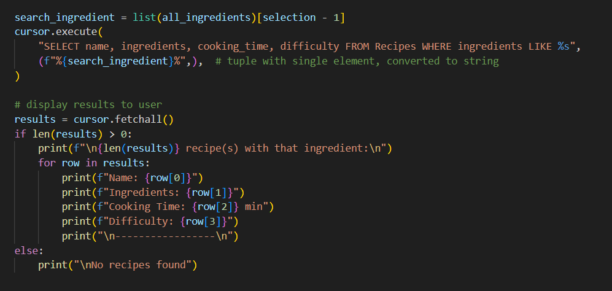


<h3>Part 5: Update Recipe with `update_recipe`</h3>

<br>_Step 1_<br>
*	Fetch all recipes and display them to the user
*	User chooses a recipe to be updated by selecting the recipe’s corresponding id

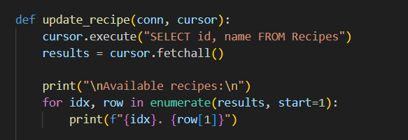


<br>_Step 2_<br>
* User selects the column that needs to be updated. The script collects the new value from the user.
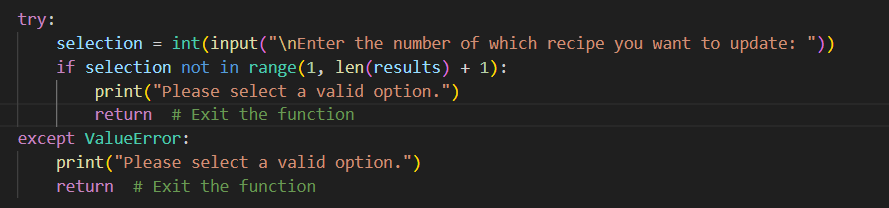


<br>_Step 3_<br>
*	Build query in the form of a string to update the table for given `id`, column, and updated value.
*	A separate query calculates a new level of difficulty if either `ingredients` or `cooking_time` are modified
  
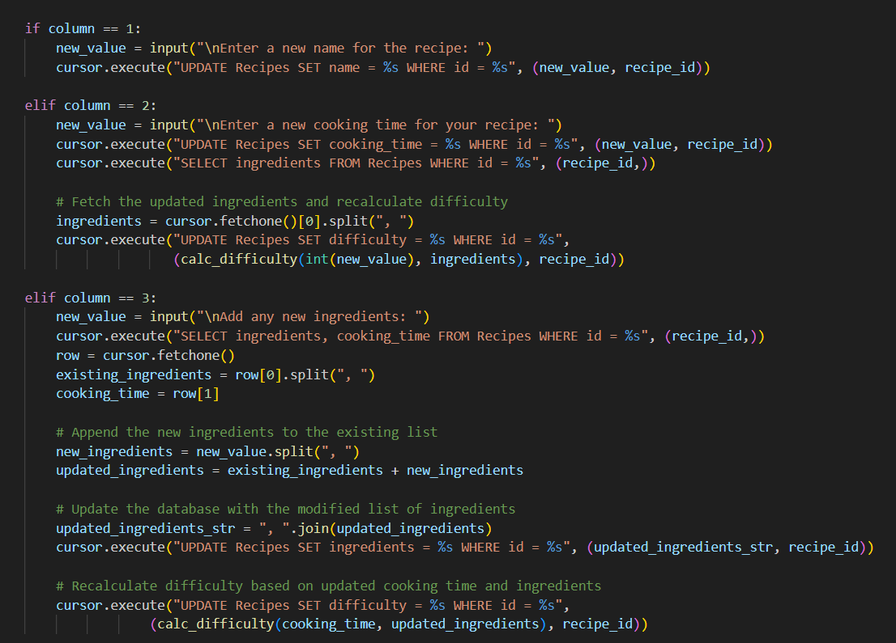


<br>_Step 4_<br>
* Execute queries on the Recipes table and commit changes
  
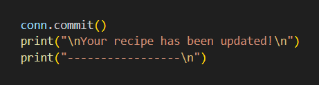


<h3>Part 6: Delete a Recipe with delete_recipe()</h3>

<br>_Step 1_<br>
*	Display all recipes in the Recipe table to the user. User selects a recipe to be deleted by id number.
  
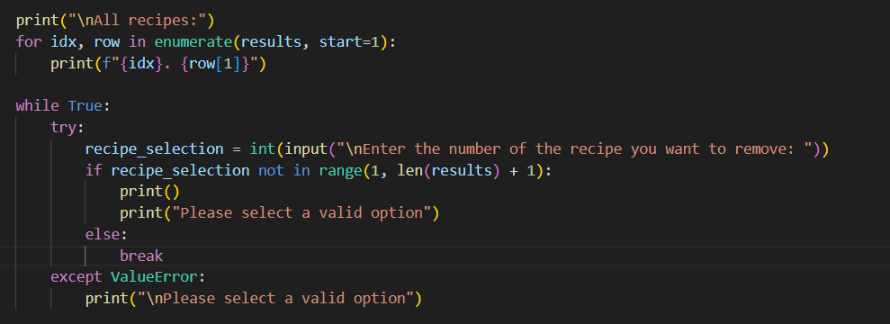


<br>_Step 2 and 3_<br>
*	SQL query `DELETE`s row, identified by previous step
* Execute query and commit changes

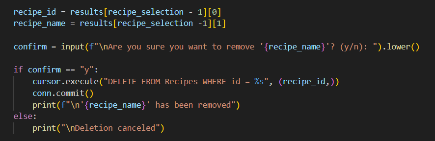


<h3>Part 7: Testing the Script</h3>

<br>_Step 1_<br>
*	Ensure MySQL Server is running and execute the script

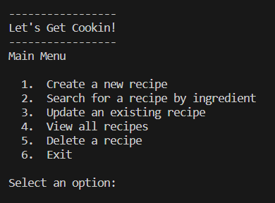


<br>_Step 2_<br>
* Create a new recipe

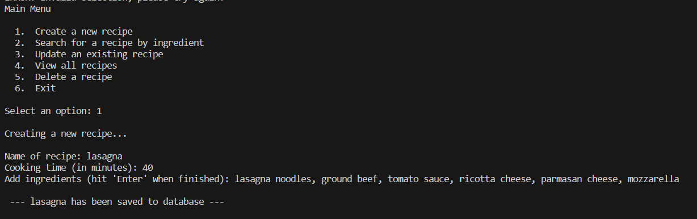


<br>_Step 3_<br>
* Search for a recipe based on ingredient

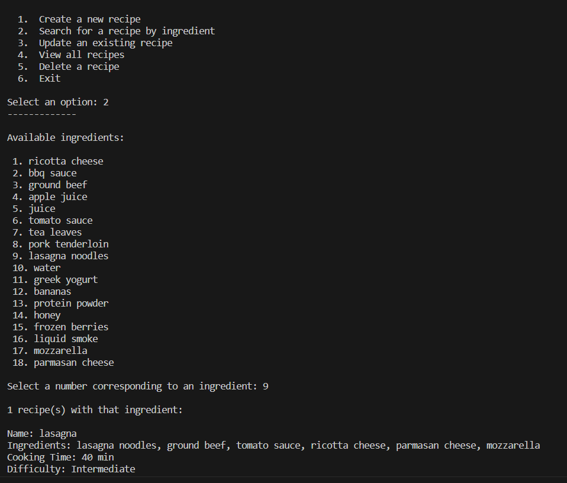


<br>_Step 4_<br>
* Update recipes

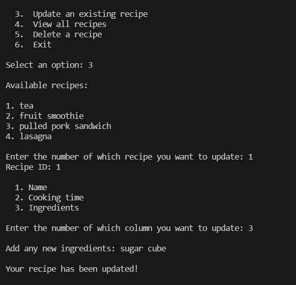
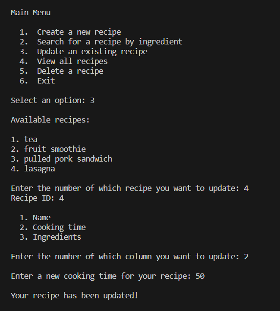


<br>_Step 5_<br>
* Delete recipe

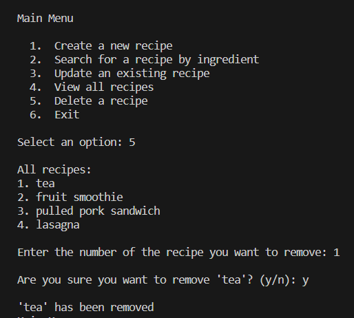


<br>_Step 6_<br>
* Exit the script

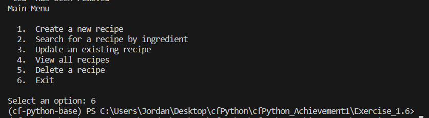


<br>_Final Results After Modification_<br>

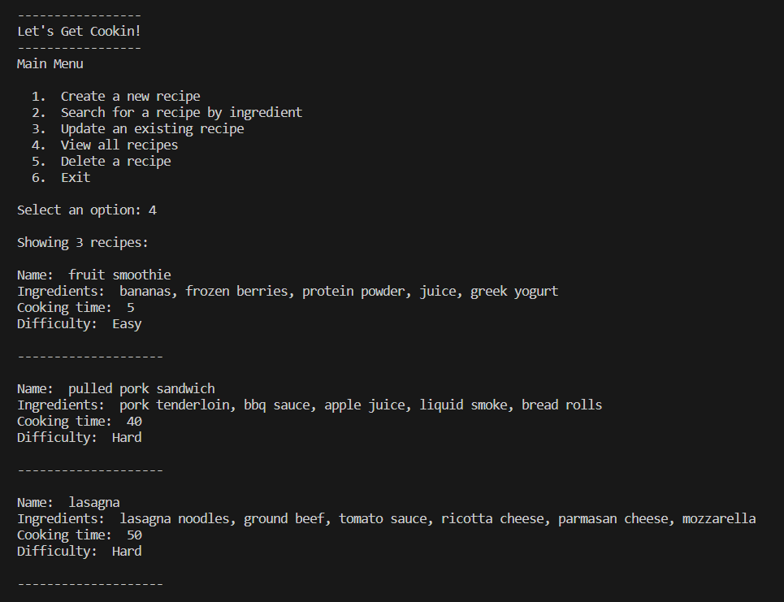


</details>


<!--------------------------------------------------------------------------------------------------------------------------------------------->
<!--------------------------------------------------------------------------------------------------------------------------------------------->

<details>
<summary><h2>Exercise 1.7: Object-Relational Mapping</h2></summary>

<details>
<summary><h4>Part 1: Set Up Script and SQLAlchemy</h4></summary>

<br>_Step 1_<br>
Open a script file called `recipe_app.py`

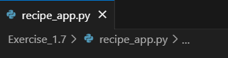


<br>_Step 2_<br>
Import all necessary packages:
```
from sqlalchemy.orm import sessionmaker
from sqlalchemy.types import Integer, String
from sqlalchemy import Column
from sqlalchemy.ext.declarative import declarative_base
from sqlalchemy import create_engine
```

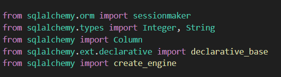


<br>_Step 3_<br>
Set up SQLAlchemy. Take note of username, password, hostname, and database name.

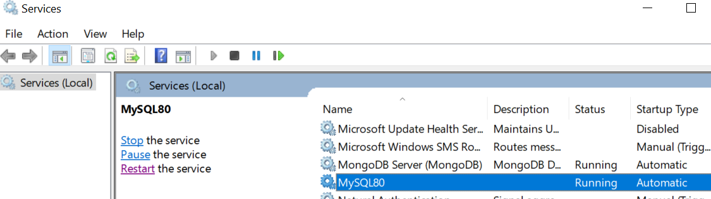


<br>_Step 4_<br>
Use the credentials and details above to create an engine object called `engine` that connects to your desired database. Ex: `task_database`

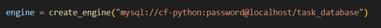


<br>_Step 5_<br>
Make the session object that you’ll use to make changes to your database. Generate the `Session class`, bind it to the `engine`, and initialize the `session` object.


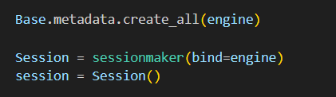


</details>

<details>
<summary><h4>Part 2: Create Model and Table</h4></summary>

Store your declarative base class into a variable called `Base`. Then, begin your definition for the `Recipe` model.
<br>_Step 1_<br>

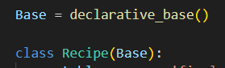

<br>_Step 2_<br>
Define an attribute to set the table’s name as `final_recipes`

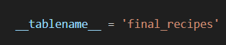


<br>_Step 3_<br>
Define the attributes to create columns in your table:
•	id: integer; primary key; increments itself automatically.
•	name: string with 50-character limit; stores the recipe’s name.
•	ingredients: string type; character limit of 255; stores the ingredients of the recipe in the form of a string.
•	cooking_time: integer; stores the recipe’s cooking time in minutes
•	difficulty: string with 20-character limit; stores one of four strings that describe the difficulty of the recipe (Easy, Medium, Intermediate, and Hard).

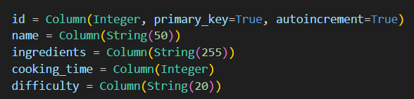


<br>_Step 4_<br>
Define a `__repr__` method that shows a quick representation of the recipe, including the `id`, `name`, and `difficulty`.

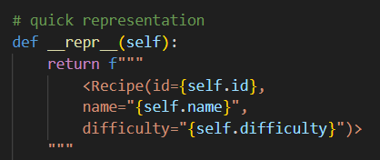


<br>_Step 5_<br>
Define a `__str__` method that prints a well-formatted version of the recipe

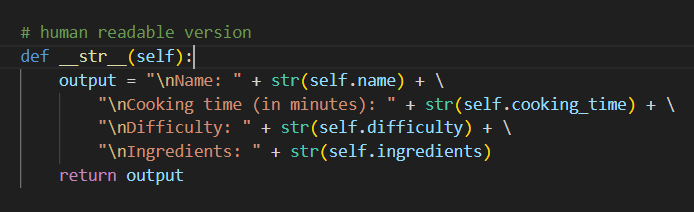

<br>_Step 6_<br>
Define a method called `calculate_difficulty()` to calculate the difficulty of a recipe based on the number of ingredients and cooking time.

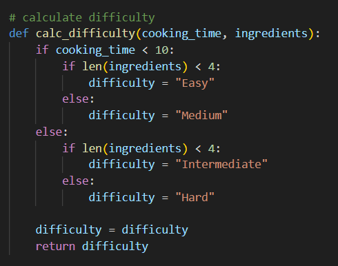

<br>_Step 7_<br>
Define a method that retrieves the ingredients string inside your Recipe object as a list, called `return_ingredients_as_list()`. It will follow these steps:
1.	If the instance variable `self.ingredients` is an empty string, return an empty list.
2.	Otherwise, use the `split()` method available to strings to split the string into a list wherever there’s a comma followed by a space (,). Return this list.

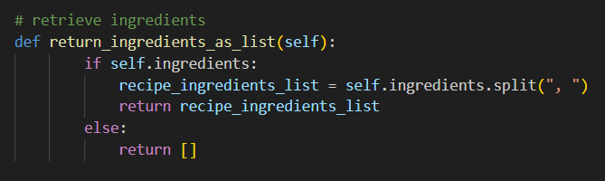

<br>_Step 8_<br>
After defining your model, create the corresponding table on the database using the `create_all()` method from `Base.metadata`.

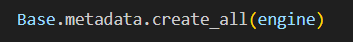


</details>

<details>
<summary><h4>Part 3: Defining Main Operations as Functions</h4></summary>

<details>
<summary><h4><br>Function 1: <code>create_recipe()</code><br></h4></summary>
1.	Collect the details of the recipe (`name`, `ingredients`, `cooking_time`) from the user.
2.	Ensure all the inputs are appropriate (e.g., `name` doesn’t extend past 50 characters, or `cooking_time` isn’t a letter of the alphabet). Use the following methods to perform these checks for a given string called `line`:
o	`len()` - use `len(line)` to get the length of `line` as an integer.
o	`isalnum()` - `line.isalnum()` gives you `True` or `False` based on whether `line` contains alphanumeric characters.
o	`isnumeric()` - `line.isnumeric()` returns `True` or `False` based on whether `line` contains only numbers.
o	`isalpha()` - `line.isalpha()` returns `True` or `False` based on whether `line` contains only alphabetical characters.
3.	Collect the ingredients from the user in the following manner:
o	Define a temporary empty list called `recipe_ingredients`.
o	Ask the user how many ingredients they’d like to enter.
o	Based on this number, run a `for` loop that collects each ingredient and then adds it to your temporary list, `recipe_ingredients`.

```
recipe_ingredients = []
    for num in range(1, int(ingredient_num) + 1):
        ingredient = input(f"\tIngredient {num}: ").strip()
        if not ingredient:
            break
        recipe_ingredients.append(ingredient)
```

4.	Convert the list `recipe_ingredients` into a string using the `join()` method, where each ingredient is joined to the other with a comma followed by a space (`,`).
`recipe_ingredients_str = ", ".join(recipe_ingredients)`
5.	Create a new object from the `Recipe` model called `recipe_entry` using the details above.

```
recipe_entry = Recipe(
        name=name,
        cooking_time=int(cooking_time),
        ingredients=recipe_ingredients_str,
        difficulty=difficulty
    )
```
6.	Generate the `difficulty` attribute for this recipe by calling its `calculate_difficulty()` method.

`difficulty = calc_difficulty(int(cooking_time), recipe_ingredients)`

7.	Add this to your database through the `session` object, and commit this change.

```
session.add(recipe_entry)
    session.commit()
```

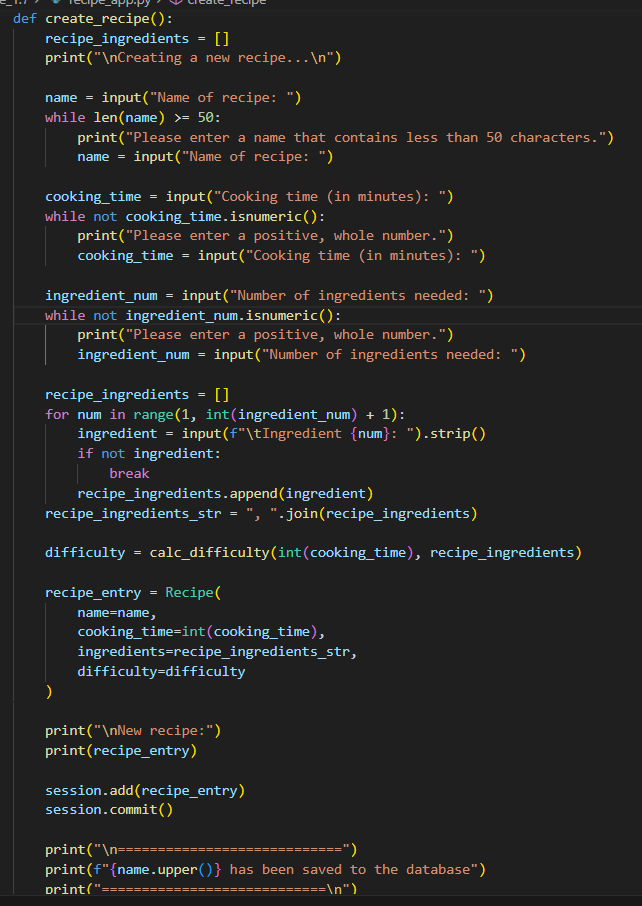

</details>

<details>
<summary><h4><br>Function 2: <code>view_all_recipes()</code><br></h4></summary>
1.	Retrieve all recipes from the database as a list.
 
```
def view_all_recipes():
    all_recipes = []
    all_recipes = session.query(Recipe).all()
```
2.	If there aren’t any entries, inform the user that there aren’t any entries in your database, and exit the function to return to the main menu.
```
if len(all_recipes) == 0:
        print("No recipes found")
        return None
```
3.	Loop through this list of recipes, and call each of their `__str__` methods to display each recipe.

```
else:
        print(f"\nShowing {len(all_recipes)} recipe(s):\n")

        for recipe in all_recipes:
            print(recipe)
```


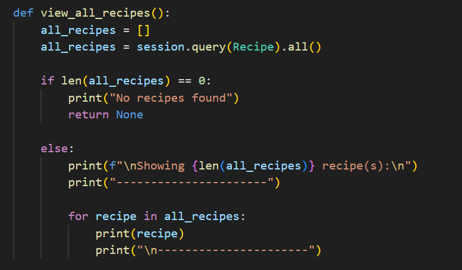

</details>

<details>
<summary><h4><br>Function 3: <code>search_by_ingredients()</code><br></h4></summary>
1.	Check if your table has any entries. Use the `count()` method like below to get the number of entries in the given table: `session.query(<model name>).count()`. If there aren’t any entries, notify the user, and exit the function.

 ```
def search_recipe():
    if session.query(Recipe).count() == 0:
        print("No recipes found")
        return None
```

2.	Retrieve only the values from the `ingredients` column of your table, and store this into a variable called `results`.
3.	Initialize an empty list called `all_ingredients`.
4.	Go through each entry in `results`, split up the ingredients into a temporary list, and add each ingredient from this list to `all_ingredients`. Check each ingredient isn’t already on the list before adding.
```
all_ingredients = []
    results = session.query(Recipe.ingredients).all()

    for total_ingredients_list in results:
        ingredients_list = total_ingredients_list[0].split(", ")
        all_ingredients.extend(ingredients_list)
```
5.	Display these ingredients to the user, where each ingredient has a number displayed next to it. Ask them by which ingredients they’d like to search for recipes.
6.	The user is allowed to pick these ingredients by typing the numbers corresponding to the ingredients, separated by spaces.
7.	Check that the user’s inputs match the options available. Otherwise, inform the user and exit the function.
8.	Based on the user’s selection as numbers, make a list of ingredients to be searched for, called `search_ingredients`, which contains these ingredients as strings.

```
available_ingredients = list(set(all_ingredients))
    print("Available ingredients: ")
    for index, ingredient in enumerate(available_ingredients, start=1):
        print(f" {index}. {ingredient}")

    try:
        selected_ingredient = input(
            "\nSelect one or more numbers corresponding to an ingredient (separate numbers by spaces): ")

        # Convert the map object to a list of indices
        selected_ingredient_indices = list(map(int, selected_ingredient.split()))

        search_ingredients = [
            available_ingredients[i - 1] for i in selected_ingredient_indices
        ]

        print("\nYou selected: ", search_ingredients)
```

9.	Initialize an empty list called `conditions`. This list will contain `like()` conditions for every ingredient to be searched for.
10.	Run a loop that runs through `search_ingredients`, and performs the following steps:
o	Make a search string called `like_term`, which is essentially the ingredient, surrounded by a `“%”` on either side (e.g., `“%Milk%”`).
o	Append the search condition containing `like_term` to the `conditions` list (e.g., `<Model name>.<column to search in>.like(like_term)`).
11.	Retrieve all recipes from the database using the `filter()` query, containing the list `conditions`. Display these recipes using the `__str__` method.
```
conditions = []
        for ingredient in search_ingredients:
            like_term = "%"+ingredient+"%"
            condition = Recipe.ingredients.like(like_term)
            conditions.append(condition)
        found_recipes = session.query(Recipe).filter(*conditions).all()

        if not found_recipes:
            print("No recipes found.")
        else:
            print(f"\n{len(found_recipes)} recipe(s) with that ingredient:\n")
            for recipe in found_recipes:
                print(recipe)
```


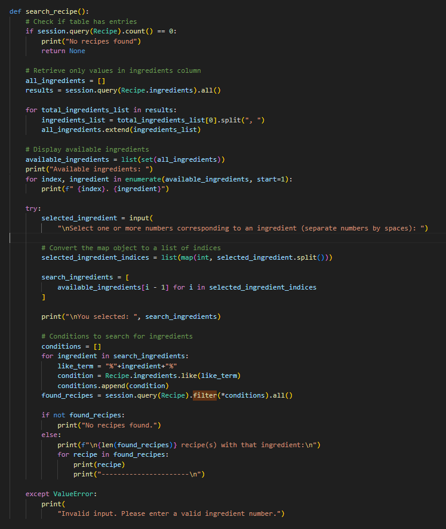

</details>

<details>
<summary><h4><br>Function 4: <code>edit_recipe()</code><br></h4></summary>
1.	Check if any recipes exist on your database, and continue only if there are any. Otherwise, exit this function.

 ```
if session.query(Recipe).count() == 0:
        print("No recipes found")
        return None
```
2.	Retrieve the `id` and `name` for each recipe from the database, and store them into `results`.
3.	From each item in `results`, display the recipes available to the user.
```
results = session.query(Recipe.id, Recipe.name).all()
    print("\nAvailable recipes:\n")
    for recipe in results:
        print("Name:", recipe[1], "\nID:", recipe[0])
```
4.	The user gets to pick a recipe by its `id`. If the chosen `id` doesn’t exist, exit the function.
5.	Retrieve the entire recipe that corresponds to this `id` from the database into a variable called `recipe_to_edit`.
6.	Display the recipe, including only `name`, `ingredients` and `cooking_time`. `difficulty` isn’t editable since it is a calculated value. Display a number next to each attribute so that the user gets to pick one.
7.	Ask the user which attribute they’d like to edit by entering the corresponding number. Remember to check the user’s input here.
```
try:
        recipe_to_edit_id = int(input("\nEnter the ID of a recipe you want to edit: "))

        if session.query(Recipe).filter(Recipe.id == recipe_to_edit_id).count() == 0:
            print("No such ID, please try again.")
            return None

        recipe_to_edit = session.query(Recipe).get(recipe_to_edit_id)
        print(f"\nEditing: {recipe_to_edit.name.upper()}")
        print(f"{recipe_to_edit}")

        print("Choose the attribute to edit:")
        print("1. Recipe name")
        print("2. Cooking time")
        print("3. Ingredients")

        column_for_update = int(input("\nSelect '1', '2', or '3': "))
```
8.	Based on the input, use `if-else` statements to edit the respective attribute inside the `recipe_to_edit` object. Recalculate the difficulty using the object’s `calculate_difficulty()` method.
```
if column_for_update == 1:
            new_name = input("\nEnter a new name for the recipe: ")
            recipe_to_edit.name = new_name

        elif column_for_update == 2:
            new_cooking_time = int(input("\nEnter a new cooking time for your recipe: "))
            recipe_to_edit.cooking_time = new_cooking_time

        elif column_for_update == 3:
            new_ingredients = input("\nAdd any new ingredients: ")
            recipe_to_edit.ingredients += ", " + new_ingredients

        else:
            print("\nWrong input, please try again.\n")
            return None
```
9.	Commit these changes to the database.


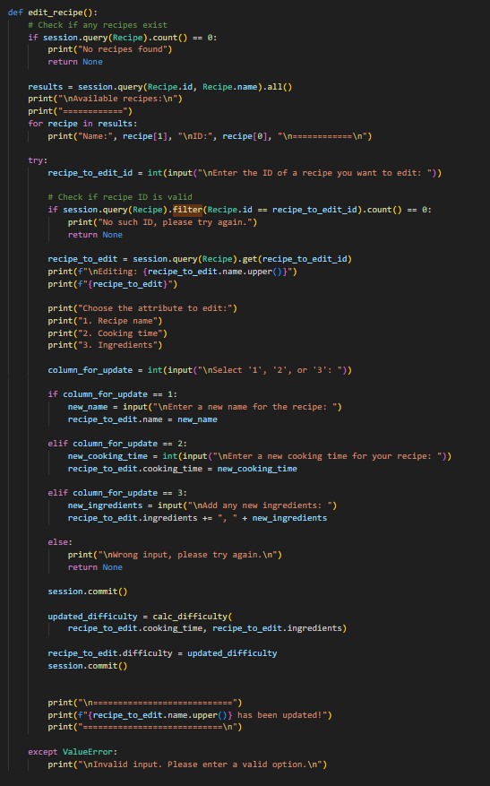

</details>

<details>
<summary><h4><br>Function 5: <code>delete_recipe()</code><br></h4></summary>

1.	Check if any recipes exist on our database, and continue only if there are any. Otherwise, exit this function.
```
def delete_recipe():
    # Check if any recipes exist
    if session.query(Recipe).count() == 0:
        print("No recipes found")
        return
```
2.	Retrieve the `id` and `name` of every recipe in the database. List these out to the user to choose from.
```
results = session.query(Recipe.id, Recipe.name).all()
    print("\nAvailable recipes:\n")
    for recipe in results:
        print(" ", recipe.name.capitalize(), "\n  ID:", recipe[0])
```
3.	Ask the user which recipe they’d like to delete by entering the corresponding `id`. Verify inputs here.
4.	Based on the selected `id`, retrieve the corresponding object that exists on the database.
5.	Ask the user if they’re sure that they’d like to delete this entry. If it’s a ‘yes’, perform the delete operation and commit this change. Otherwise, exit the function.
```
recipe_id_for_deletion = input("\nEnter the ID of the recipe you want to delete: ")

    try:
        recipe_id_for_deletion = int(recipe_id_for_deletion)
        recipe_to_delete = session.query(Recipe).filter(
            Recipe.id == recipe_id_for_deletion).one()

        confirm = input(
            f"\nAre you sure you want to remove '{recipe_to_delete.name.upper()}'? (y/n): ").lower()
        if confirm == "y":
            session.delete(recipe_to_delete)
            session.commit()
            print(f"'{recipe_to_delete.name}' has been removed.")
        else:
            print("\nDeletion canceled")
```


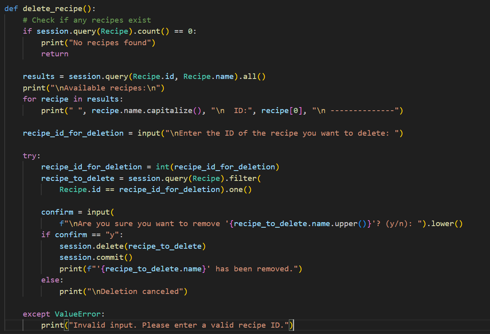


</details>
</details>

<details>
<summary><h4>Part 4: Designing the Main Menu</h4></summary>

<br>_Step 1_<br>

Print the 6 options to display on the main menu:
•	Create a new recipe
•	View all recipes
•	Search for recipes by ingredients
•	Edit a recipe
•	Delete a recipe
•	Additionally, tell the user to type quit to quit the application.


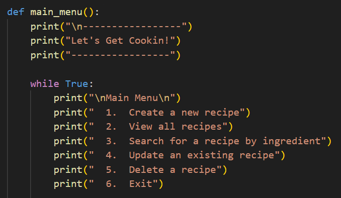


<br>_Step 2_<br>
Using `if-elif` statements, launch the corresponding function based on the user’s input. Use an `else` statement at the end to handle any malformed input by informing the users of this error and having the loop simply continue to its next iteration to display the main menu again.

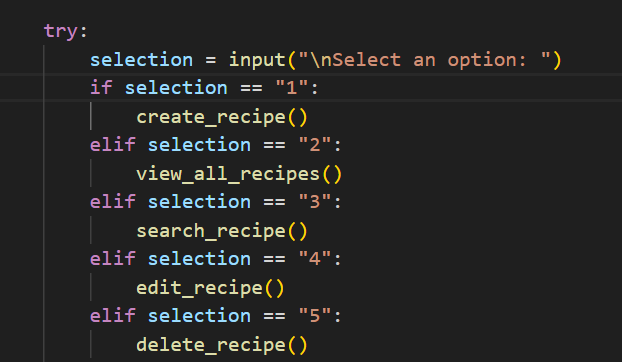


<br>_Step 3_<br>
Once the user chooses to quit, close `session` and `engine` with their respective `close()` methods, and the script ends there.

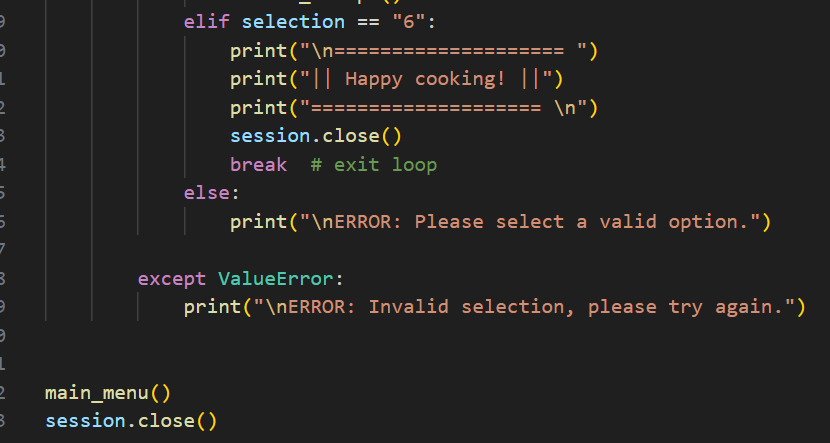


</details>

<details>
<summary><h4>Part 5: Testing</h4></summary>


</details>


</details>

